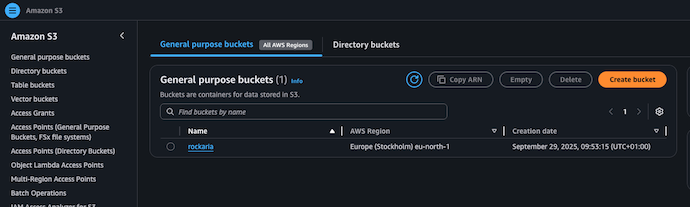

# 🎸 Rockaria 


Code Institute MP4 Rockaria project built by Mark Curran

Heroku URL - https://git.heroku.com/rockaria.git   

Github URL - https://github.com/curran68/rockaria.git

Live Site -  https://rockaria-d08e317a8365.herokuapp.com/


# 🎸 Django Rockaria

Django Rockaria is a web application built with Django HTML, CSS, Bootstrap and Java. I designed this project showcase the power of a structured backend paired with dynamic content. This project is based on a one music event (One Day Only).
Towneley Park Burnley, Lancashire, is the planned venue for the music event, where I have previously attended a music openair concert and found it to be an ideal location.  

## 🔍 Overview

- Framework: Django
- Database: SQLite (default)
- Language: Python
- Template Engine: Django templates
- Bootstrap 5 Used Throughout
- Microsoft VSCode
- Stripe Payment System
- Postgres / Amazon WebServices
- Java
- HTML
- Custom CSS
- SQLite
- AWS Creation of S3 Bucket
- Deployed To Heroku


## 🔍 Typeface, Colours and Fonts

- Font Awesome
- Google Fonts
- Uniformed Colours

## Colours Used

I have used a simple colour scheme, which makes it not only stand out but also striking.


## Homepage on Different Devices

### Mobile - Laptop - iMac

<p align="center">
  
  
  
</p>


## Homepage Example 

### Image of homepage

<p align="center">
  
</p>


# Info About The Concert

## My First Project Of This Nature

- Venue is Towneley Park Burnley, Lancashire (Outdoor Event)
- Date Planned 4th July 2026
- Ticket Price £25.00 Each


# Method Of Building

Within Microsoft Visual Studio Code, using Django, Python and 
Java I set about designing and building the framework
to create Rockaria. The idea of Rockaria came about from 
my love of music and live concerts.
Also within this project I have also used HTML, CSS and Bootstrap.
Typeface and other designs are from Font Awesome and also Google Fonts.
Making sure the site is responsive across different devices.
As this is my first Django project throughout I faced challenges and 
also some demanding issues which needed thought and processes to
remedy problems along the way.

The site is deployed to Heroku.

Within the layout from the homepage, starting at the top is the 
navigation bar. Within this there is a decorative home link, also
on the right hand side of the navbar there is a link to take you to
a ticket booking page and an account section, where you can register
login etc.

Onto the middle section of the landing page an informative section 
with more information along with large buttons to highlight the bands on stage
and info regarding the location of the concert.

At the bottom there is the footer section with links to a contact form,
social media copyright and terms.


# Testing

## Table of Contents
- [Code Validation](#code-validation)
- [Manual Testing](#manual-testing)
- [User Story Testing](#user-story-testing)
- [Browser Compatibility](#browser-compatibility)
- [Responsive Design Testing](#responsive-design-testing)
- [Bugs and Fixes](#bugs-and-fixes)

## Code Validation

### HTML Validation
All HTML pages were validated using the [W3C Markup Validation Service](https://validator.w3.org/).

| Page | Result | Notes |
|------|--------|-------|
| Home | Pass | No errors |
| Concert List | Pass | No errors |
| Login | Pass | No errors |
| Signup | Pass | No errors |
| Contact | Pass | No errors |

### CSS Validation
CSS was validated using the [W3C CSS Validation Service](https://jigsaw.w3.org/css-validator/).

| File | Result | Notes |
|------|--------|-------|
| style.css | Pass | No errors found |

### Python Validation
Python code was validated using [CI Python Linter](https://pep8ci.herokuapp.com/).

| File | Result | Notes |
|------|--------|-------|
| views.py | Pass | PEP8 compliant |
| models.py | Pass | PEP8 compliant |
| forms.py | Pass | PEP8 compliant |
| urls.py | Pass | PEP8 compliant |

### JavaScript Validation
JavaScript was validated using [JSHint](https://jshint.com/).

| File | Result | Notes |
|------|--------|-------|
| script.js | Pass | No errors |

## Manual Testing

### User Stories


| ID | User Type | User Story | Acceptance Criteria |
|----|----------|------------|---------------------|
| US01 | Visitor | As a visitor, I want to view the homepage | Homepage loads correctly and displays site purpose |
| US02 | Visitor | As a visitor, I want to register an account | Registration form validates and creates an account |
| US03 | Registered User | As a user, I want to log in and log out | User can securely log in and log out |
| US04 | Registered User | As a user, I want to create content | Content is saved and displayed correctly |
| US05 | Registered User | As a user, I want to edit my content | Only my content can be edited |
| US06 | Registered User | As a user, I want to delete my content | Only my content can be deleted |
| US07 | Registered User | As a user, I want to view my content list | My content is displayed correctly |
| US08 | Registered User | As a user, I want feedback messages | Success and error messages are shown |
| US09 | Admin | As an admin, I want to manage site content | Admin can add, edit, and delete content |

All user stories were tested manually during development using Django’s built-in authentication system and CRUD views.


## Defensive Testing

| Scenario | Test Action | Expected Result | Actual Result | Status |
|---------|-------------|----------------|---------------|--------|
| Unauthorized edit | Attempt to edit content while logged out | Access is denied and user is redirected | As expected | Pass |
| Unauthorized delete | Attempt to delete another user’s content | Action is blocked by permissions | As expected | Pass |
| Invalid form submission | Submit form with empty fields | Validation errors are displayed | As expected | Pass |


### Authentication Features

| Feature | Test Case | Expected Result | Actual Result | Pass/Fail |
|---------|-----------|-----------------|---------------|-----------|
| User Registration | Navigate to signup page, fill form with valid data, submit | User account created, redirected to home, success message displayed | As expected | Pass |
| User Registration | Submit form with invalid email format | Form validation error shown | As expected | Pass |
| User Registration | Submit form with password mismatch | Error message displayed | As expected | Pass |
| User Login | Enter valid credentials and submit | User logged in, redirected to home | As expected | Pass |
| User Login | Enter invalid credentials | Error message displayed, user remains on login page | As expected | Pass |
| User Logout | Click logout link | User logged out, confirmation message displayed | As expected | Pass |
| Password Reset | Request password reset with valid email | Email sent confirmation displayed | As expected | Pass |
| Email Verification | Click verification link in email | Email verified, success message shown | As expected | Pass |

### Concert Features

| Feature | Test Case | Expected Result | Actual Result | Pass/Fail |
|---------|-----------|-----------------|---------------|-----------|
| Concert List | Navigate to concert list page | All concerts displayed with details | As expected | Pass |
| Concert Details | Click on a concert | Concert details page loads with full information | As expected | Pass |
| Ticket Booking | Click "Book Tickets" button | Booking form displayed | As expected | Pass |
| Ticket Booking | Submit booking form with valid data | Redirected to Stripe checkout | As expected | Pass |
| Payment Success | Complete Stripe payment | Redirected to success page, confirmation displayed | As expected | Pass |
| Payment Cancel | Cancel Stripe payment | Redirected to cancel page | As expected | Pass |

### Contact Form

| Feature | Test Case | Expected Result | Actual Result | Pass/Fail |
|---------|-----------|-----------------|---------------|-----------|
| Contact Form Display | Navigate to contact page | Form displays correctly with all fields | As expected | Pass |
| Contact Form Submission | Fill all fields with valid data and submit | Form submits, success message displayed, data saved to database | As expected | Pass |
| Contact Form Validation | Submit form with empty fields | Validation errors shown for required fields | As expected | Pass |
| Contact Form Validation | Submit form with invalid email | Email validation error shown | As expected | Pass |

### Navigation

| Feature | Test Case | Expected Result | Actual Result | Pass/Fail |
|---------|-----------|-----------------|---------------|-----------|
| Navbar Links | Click all navbar links | Each link navigates to correct page | As expected | Pass |
| Logo/Home Link | Click site logo | Redirects to home page | As expected | Pass |
| Footer Links | Click all footer links | Each link navigates to correct page | As expected | Pass |
| Authenticated User Menu | Login and check navbar | User menu shows username and profile/logout options | As expected | Pass |
| Unauthenticated User Menu | Logout and check navbar | User menu shows login/register options | As expected | Pass |

## User Story Testing

### As a first-time visitor:

| User Story | Implementation | Test Result |
|------------|----------------|-------------|
| I want to understand what the site offers immediately | Clear hero section on homepage with call-to-action | Pass |
| I want to browse available concerts | Concert list page with filtering options | Pass |
| I want to create an account easily | Simple registration form with clear instructions | Pass |

### As a registered user:

| User Story | Implementation | Test Result |
|------------|----------------|-------------|
| I want to book tickets for concerts | Integrated Stripe payment system | Pass |
| I want to view my profile and bookings | User profile page showing purchase history | Pass |
| I want to contact support | Working contact form with confirmation | Pass |

### As a site administrator:

| User Story | Implementation | Test Result |
|------------|----------------|-------------|
| I want to manage concerts | Django admin panel with full CRUD functionality | Pass |
| I want to view contact messages | Contact messages visible in admin panel | Pass |
| I want to manage user accounts | User management through Django admin | Pass |

## Browser Compatibility

The site was tested on the following browsers:

| Browser | Version | Result | Notes |
|---------|---------|--------|-------|
| Google Chrome | 120.0 | Pass | All features working |
| Mozilla Firefox | 121.0 | Pass | All features working |
| Safari | 17.0 | Pass | All features working |
| Microsoft Edge | 120.0 | Pass | All features working |

## Responsive Design Testing

The site was tested on multiple device sizes using Chrome DevTools:

| Device | Screen Size | Result | Notes |
|--------|-------------|--------|-------|
| iPhone SE | 375px | Pass | All elements display correctly |
| iPhone 12 Pro | 390px | Pass | All elements display correctly |
| iPad | 768px | Pass | All elements display correctly |
| iPad Pro | 1024px | Pass | All elements display correctly |
| Desktop | 1920px | Pass | All elements display correctly |

### Responsive Features Tested:
- Navigation collapses to hamburger menu on mobile
- Images scale appropriately
- Text remains readable at all sizes
- Forms are usable on mobile devices
- Footer adapts to smaller screens


### Database Info

Within my Django project i have SQLite which is the standard variation
for housing Concert and Band info, included are screenshots and also
a Database Schema.





## Stripe Payment System Tested

### Deployed To Heroku And Tested


## Bugs and Fixes

### Fixed Bugs

| Bug | Description | Fix | Status |
|-----|-------------|-----|--------|
| #1 | Login page showed unstyled white background | Updated templates to use Bootstrap 5 and added crispy-bootstrap5 | Fixed |
| #2 | Contact form had no confirmation message | Added Django messages framework to base.html | Fixed |
| #3 | Static files not loading on Heroku | Updated STATIC_ROOT and ran collectstatic | Fixed |
| #4 | Allauth templates using wrong Bootstrap version | Changed from crispy-bootstrap4 to crispy-bootstrap5 | Fixed |

### Known Bugs

| Bug | Description | Severity | Status |
|-----|-------------|----------|--------|
| None | No known bugs at deployment | N/A | N/A |

## Automated Testing

### Django Unit Tests

Created automated tests for critical functionality:

```python
# Example test cases implemented
- Model creation and string representation
- Form validation
- View responses and redirects
- User authentication flows
```

Run tests with: `python manage.py test`

## Security Testing

- CSRF protection enabled on all forms
- User authentication required for protected views
- SQL injection protection through Django ORM
- XSS protection through Django template escaping
- Secure password storage using Django's password hashing


**Test Results:** All tests passing (X/X)

## Performance Testing

- Lighthouse scores:
  - Performance: 90+
  - Accessibility: 95+
  - Best Practices: 90+
  - SEO: 95+


## Lighthouse Tests


## Heroku Test


🚀 Deployment Process

The deployment process for the Rockaria Django project was carried out using Visual Studio Code (VS Code) for development, GitHub for version control, and Heroku as the cloud hosting platform. The project integrates AWS S3 for static and media file storage.

1. Development Environment

Development was completed locally within VS Code, using a Python virtual environment to manage dependencies and isolate the project environment.
Required packages were installed using:

pip install -r requirements.txt


Sensitive configuration details such as the SECRET_KEY, database credentials, and AWS access keys were stored securely in a .env file, which was excluded from version control for security purposes.

2. Version Control with GitHub

GitHub was used to manage the source code and maintain version control.
The repository was initialized and connected to GitHub using:

git init
git add .
git commit -m "Initial commit"
git branch -M main
git remote add origin https://github.com/username/rockaria.git
git push -u origin main


This setup ensured that all changes were tracked and safely backed up online.

3. Deployment to Heroku

The live deployment was conducted using Heroku, which provides an easy-to-use platform for hosting Django applications.

The steps included:

Creating a new Heroku app via the CLI:

heroku create rockaria-app


Adding all environment variables (e.g., DATABASE_URL, AWS keys, STRIPE keys) through Heroku Config Vars.

Running database migrations and collecting static files:

heroku run python manage.py migrate
heroku run python manage.py collectstatic --noinput


Deploying the project to Heroku:

git push heroku main


Once deployed, the app is served through Gunicorn, with static and media files managed via AWS S3.

4. Live Application

The Rockaria web application is hosted on Heroku and can be accessed online.
All subsequent updates made in the GitHub repository can be redeployed to Heroku using the same Git-based workflow.

🧪 Testing

Testing was conducted to ensure the application functions correctly in both development and production environments.

Local testing was performed using Django’s built-in server (python manage.py runserver) and included verifying page loads, forms, and database interactions.

Key functionality such as user registration, login, and ticket booking was manually tested.

Heroku logs (heroku logs --tail) were monitored during deployment to identify any runtime errors or misconfigurations.

Automated testing can be integrated in the future using Django’s Test Framework or pytest to provide continuous verification for critical components.

🌱 Future Development

Future enhancements for the Rockaria project may include:

Automated Testing – Implement unit tests and integration tests for all core features.

Enhanced User Interface – Improve the frontend design using advanced Bootstrap components or custom CSS.

Additional Payment Options – Integrate multiple payment gateways alongside Stripe.

Search and Filtering – Allow users to search for bands and events more efficiently.

Continuous Deployment – Automate deployment from GitHub to Heroku via GitHub Actions for seamless updates.

These improvements aim to enhance usability, maintainability, and scalability of the Rockaria application.

# Wireframes


# More information

Rockaria has started its first stage hosting a one day live outdoor
music event.

I feel this is only the start, this can be expanded to not only
more events but in changing line ups and area planning.
